# Sistema Societário

Aplicação full-stack desenvolvida originalmente para atender às necessidades operacionais do setor societário de uma empresa de contabilidade.

O sistema centraliza a gestão de empresas, alvarás, certificados digitais e contratos, permitindo o acompanhamento de vencimentos, a geração de documentos padronizados e a criação automática de cards de renovação no Trello.

A aplicação foi projetada para execução em ambiente local, com foco em simplicidade operacional, baixo custo de infraestrutura e redução de tarefas manuais. O sistema permanece em uso no fluxo interno da empresa para a qual foi desenvolvido.

Para apresentação neste portfólio, elementos visuais, informações e referências relacionadas à empresa original foram removidos ou substituídos.

---

## Demonstração da Interface


| **Dashboard & Métricas** | **Dashboard (Continuação)** |
| :---: | :---: |
| 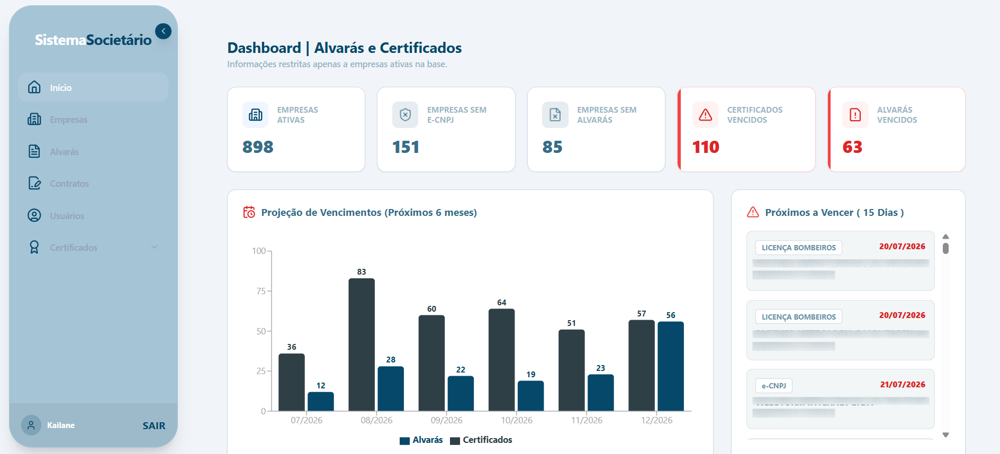 | 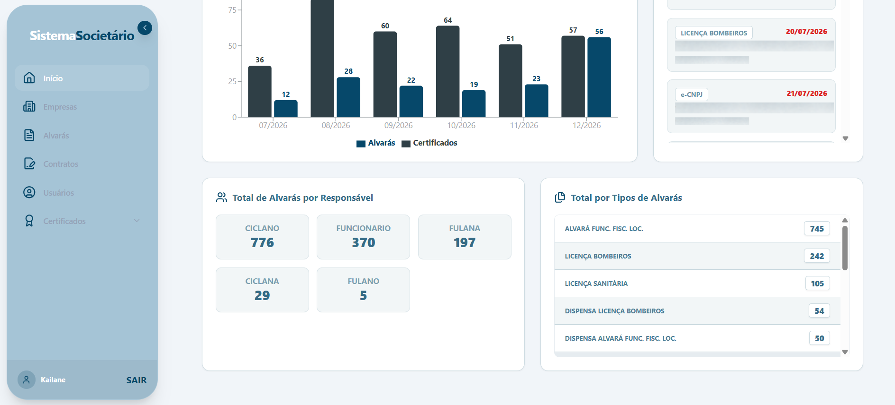 |
| **Gestão de Empresas** | **Gestão de Usuários** |
| 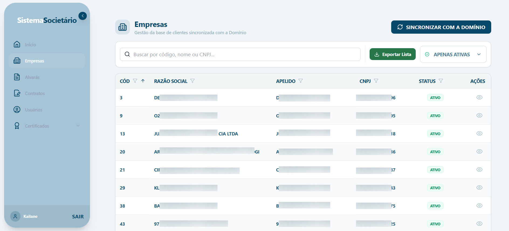 | 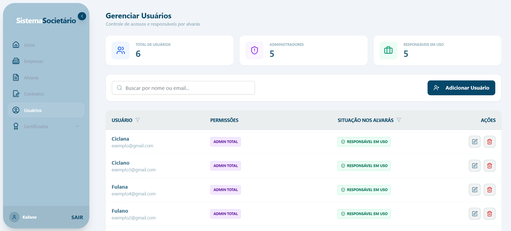 |
| **Gestão de Alvarás** | **Gestão de Contratos** |
| 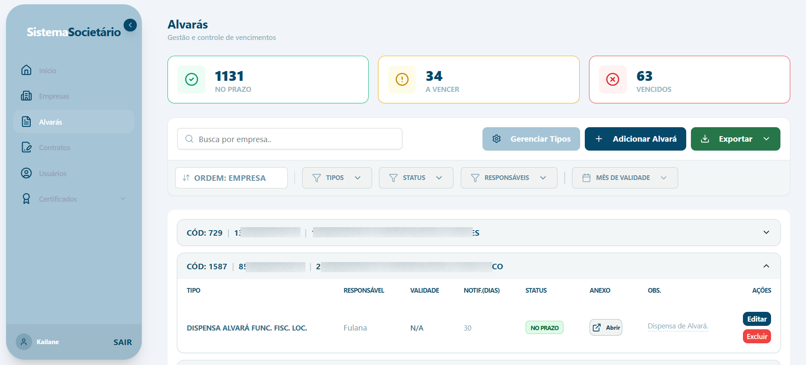 | 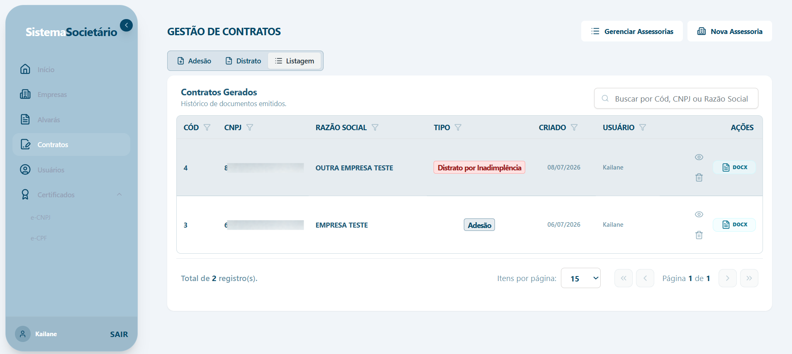 |
| **Certificados e-CNPJ** | **Certificados e-CPF** |
| 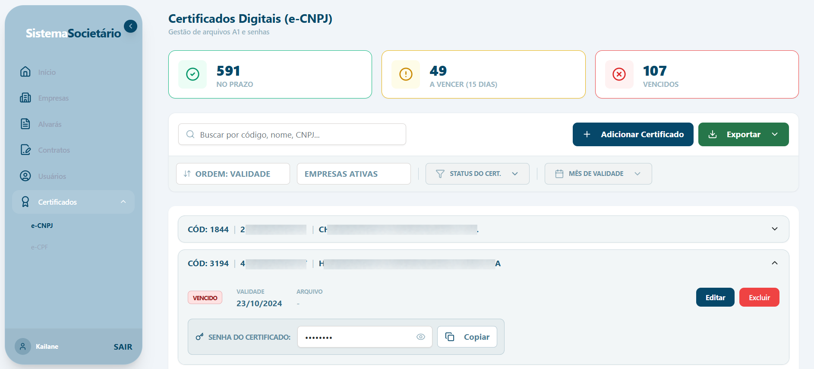 | 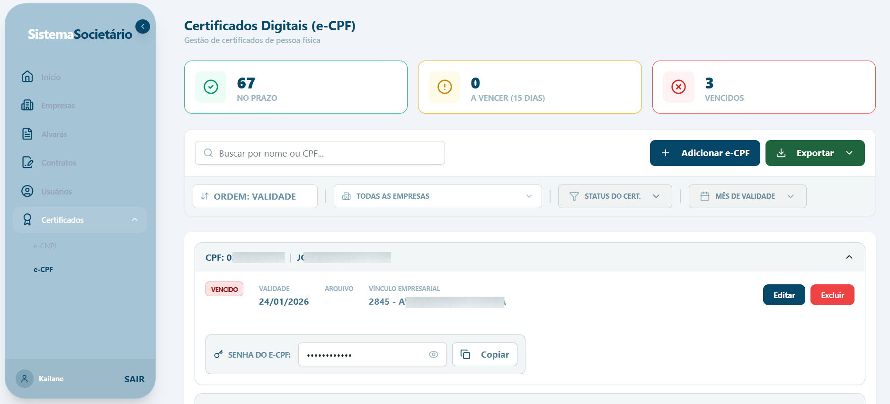 |
| **Formulário de Adesão** | **Adesão (Continuação)** |
| 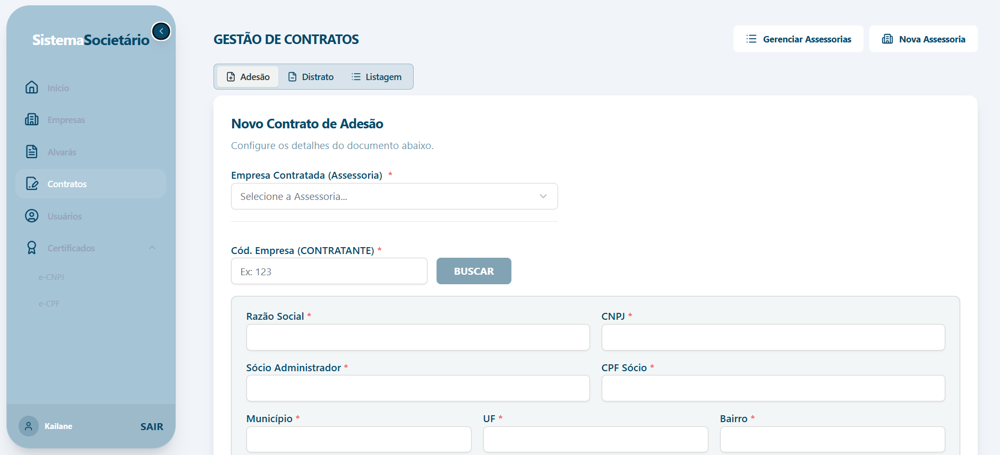 | 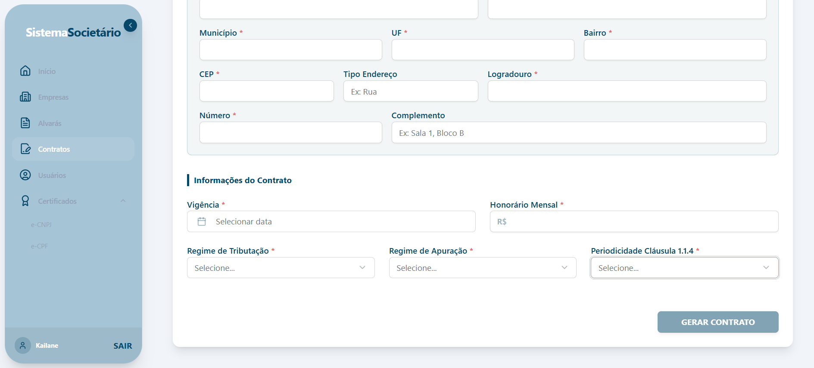 |
| **Formulário de Distrato** | **Distrato Inadimplência** |
| 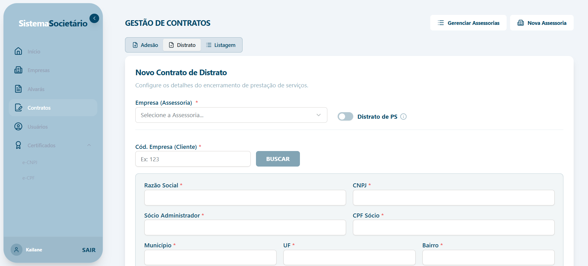 | 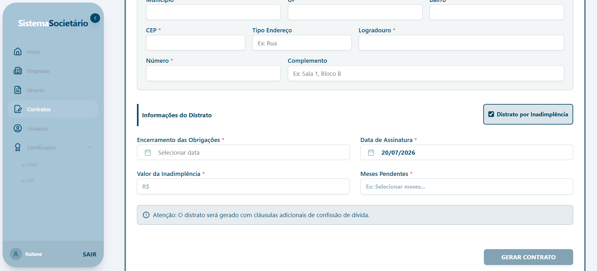 |
| **Tela de Login** | **Tela de Criação de usuário** |
| 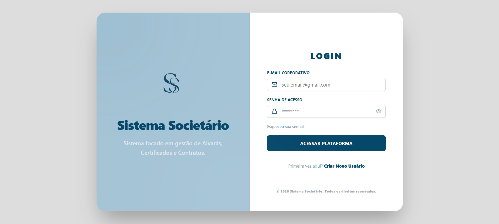 | 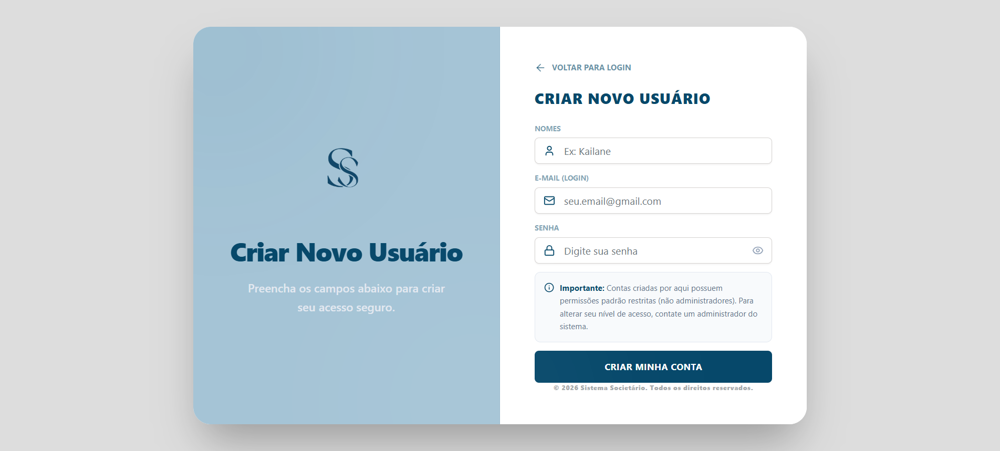 |
---

## Tecnologias Utilizadas

### Frontend
* **React (com Vite):** Biblioteca utilizada na construção de uma interface modular, com o Vite como ferramenta de desenvolvimento e build.
* **TypeScript:** Adiciona tipagem estática para maior segurança e prevenção de bugs.
* **Tailwind CSS & Shadcn UI:** Utilizados para estilização responsiva, limpa e componentes acessíveis.
* **TanStack Router:** Responsável pelo gerenciamento de rotas e proteção de páginas privadas.
* **Axios:** Comunicação HTTP com o backend utilizando interceptadores e envio de cookies de sessão em requisições HTTP por meio da opção `withCredentials`.

### Backend
* **Python (Flask):** Microframework escolhido pela flexibilidade e agilidade no desenvolvimento da API.
* **SQLAlchemy & Flask-Migrate:** Utilizados para o mapeamento dos dados relacionais e o gerenciamento das migrações do banco de dados.
* **Flask-Login:** Autenticação baseada em sessão, com cookies configurados como `HttpOnly`, reduzindo o risco de acesso ao cookie por scripts executados no navegador.
* **APScheduler:** Agendamento de tarefas em segundo plano, como a verificação diária de vencimentos.
* **Integração com API do Trello:** Criação automática de cards para o acompanhamento de renovações.
* **SQLite:** Banco de dados utilizado pela aplicação em ambiente local, atendendo ao requisito de simplicidade operacional e ausência de custos adicionais de infraestrutura.

---

## Arquitetura e Segurança
* **Hashing de Senhas:** Utilização da biblioteca `werkzeug.security` para o armazenamento seguro das senhas.
* **Recuperação de Acesso:** Geração de tokens assinados com prazo de expiração utilizando `itsdangerous`, enviados ao usuário por e-mail via SMTP.
* **CORS e Proxy:** Utilização do proxy no Vite, configurado em `vite.config.ts` para simplificar a comunicação entre frontend e backend no ambiente de desenvolvimento e permitir o envio dos cookies de sessão.
---

## Principais Funcionalidades

- Cadastro e gerenciamento de empresas e usuários.
- Controle de alvarás e respectivos vencimentos.
- Gestão de certificados digitais e-CNPJ e e-CPF.
- Geração padronizada de contratos de adesão e distrato.
- Alertas automáticos de vencimento.
- Criação automática de cards no Trello.
- Recuperação de senha por e-mail.
- Dashboard com indicadores e métricas.
---

## Como rodar o projeto localmente

Para rodar este projeto em sua máquina, siga os passos abaixo.

### Pré-requisitos
* [Node.js](https://nodejs.org/) (versão 18+)
* [Python](https://www.python.org/) (versão 3.10+)

### 1. Configurando o Backend (API)

```bash
# Navegue até a pasta do backend
cd backend

# Crie o ambiente virtual
python -m venv venv

# Ative o ambiente virtual
# No Windows:
venv\Scripts\activate
# No Linux/Mac:
source venv/bin/activate

# Instale as dependências
pip install -r requirements.txt

```
Crie uma cópia do arquivo .env.example, renomeie-a para .env e preencha as variáveis de ambiente necessárias.

Em seguida, aplique as migrações do banco de dados:

```bash
flask db upgrade

#iniciando o servidor
python  run.py

```
Obs: toda vez que o sistema é iniciado é feita a verificação de se possuem cards pendentes a serem criados (com a função check_and_create_trello_cards), e ele já cria nesse momento.


### 2. Configurando Frontend (Interface)

```bash

# Entre na pasta do frontend
cd frontend

# Instale as dependências do React
npm install

# Inicie o servidor de desenvolvimento
npm run dev

```

Caso o endereço do backend seja alterado, ajuste sua configuração nos seguintes arquivos:
* frontend/src/features/apps/alvaras/index.tsx 
* frontend/vite.config.ts

## Licença

Este projeto foi reconstruído e adaptado para apresentação em portfólio. Todos os direitos sobre esta versão do código e seus materiais estão reservados. Não é permitida sua cópia, distribuição ou utilização comercial sem autorização prévia.
